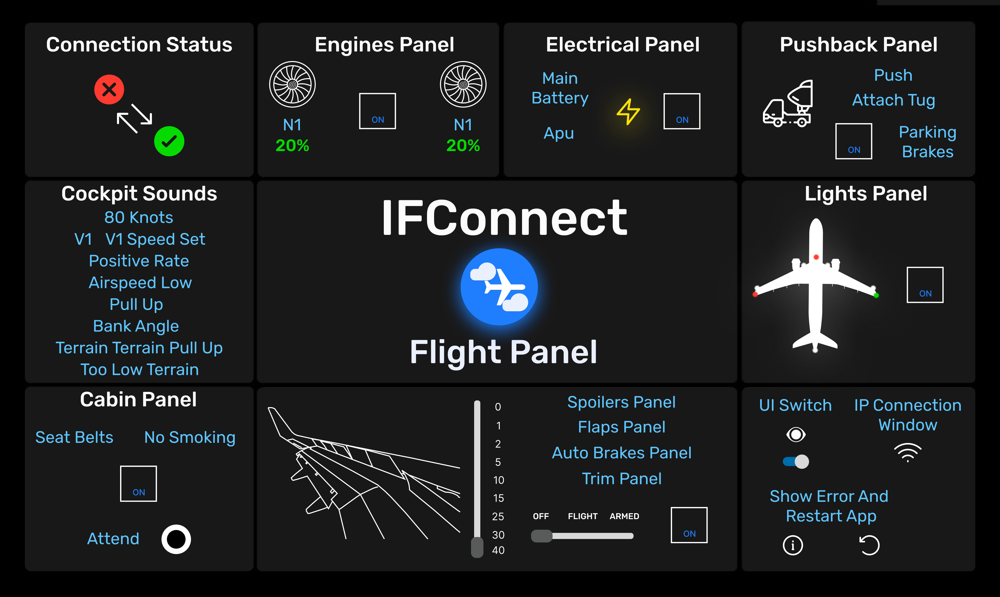

# **IFConnect**

**Flight Panel**

IFConnect is a third-party flight panel application designed for Infinite Flight, providing an intuitive interface for flight controls and real-time status monitoring.

## Overview

IFConnect offers a comprehensive panel layout for managing various aircraft systems like engines, electrical systems, pushback, lights, and more.

### Trailer

---

## Features

- **Connection Status**: Real-time connection feedback.
- **Engines Panel**: Monitor and control engine parameters.
- **Electrical Panel**: Manage essential electrical systems like main battery and APU.
- **Pushback Panel**: Controls for ground handling and parking brakes.
- **Lights Panel**: Easy management of aircraft lighting.
- **Cockpit Sounds**: Real-time alerts and callouts for V-speeds and terrain warnings.
- **Cabin Panel**: Control seatbelt and no-smoking signs.
- **Spoilers & Flaps**: Control aerodynamic surfaces for landing and takeoff configurations.

---

## Installation

To install IFConnect, follow these steps:

1. [Download the latest release](https://github.com/brk-ozs11/Mac-Circle/releases/latest) of IFConnect.
2. Locate the `.app` file in your Downloads folder.
3. Drag the `.app` file into your Applications folder to install it.

Once installed, you can launch IFConnect from your Applications folder.

---

## Support

If you enjoy using IFConnect and would like to support future development:

---

## License

This project is licensed under the MIT License. See the [LICENSE](LICENSE) file for details.

_Last Updated: September 26, 2023_
